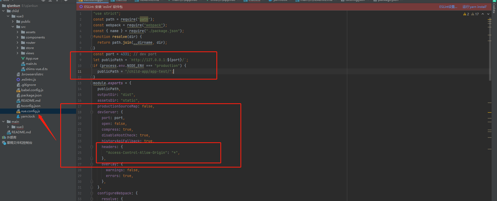

#微前端
##主应用
* ### 主应用安装 qiankun 
  ```javascript
  yarn add qiankun
* ### 主应用修改文件
  主要修改的文件有 
  - src/App.vue  
  - src/main.ts  
  + ####src/App.vue 添加子应用节点
  ```javascript
  <div id="container"></div>
  ```
  
  + ####src/mian.ts 添加子应用
  ```javascript
  import {registerMicroApps, start, setDefaultMountApp,} from "qiankun";
  
  createApp(App).use(store).use(router).mount("#app");
  registerMicroApps([
    {
      name: "app-test", //子应用名称 和子应用的package的那么一致
      entry: "//127.0.0.1:4331", //子应用地址，假设此项目名称为智能质检应用（下面演示生命周期的时候会用到）
      container: "#container", //子应用要挂载的节点，和vue.$mount("#app")类似; 在App.vue的节点上
      activeRule: "/app-test", //重点：路由命中规则，当浏览器链接有/app-test时候，例如http://localhost:9000/quality/* ，就可以自动的把http://localhost:808挂载到本地的#container节点下
      // activeRule 建议设置和子应用的router的 history: createWebHistory("/app-test"),一致
    },
  ]);
  
  
  // 启动默认应用 应用没有默认路由才会启动默认应用，反之, 可以去掉 use(router) 查看效果
  setDefaultMountApp("/app-test");
  
  // 启动 qiankun
  start();
  ```
  

##子应用
* ### 子应用不需要安装 qiankun 
* ### 子应用修改文件
  主要修改的文件有 
  - public/index.html 
  - vue-config.js 
  - package.json 
  - src/main.ts 
  - src/router/index  
  1. ####public/index.html 改子应用挂载节点 和 src/main.ts一起修改
  ####public/index.html
  ```javascript
  <div id="app-test"></div>
  ```
  
  ####src/main.ts
  ```javascript
  let instance: any = null;
  
  function render(props?: any) {
  instance = createApp(App)
  .use(store)
  .use(router)
  .mount(
  props && props.container
  ? props.container.querySelector("#app-test")
  : "#app-test" // 节点不一样来区分子应用
  );
  }
  
  // eslint-disable-next-line @typescript-eslint/ban-ts-comment
  // @ts-ignore
  // 判断是不是乾坤微前端 这是本地运行
  if (!window.__POWERED_BY_QIANKUN__) {
  render();
  }
  
  // 生命周期
  // eslint-disable-next-line @typescript-eslint/explicit-module-boundary-types
  export async function bootstrap() {
  console.log("[vue] vue app bootstraped");
  }
  // eslint-disable-next-line @typescript-eslint/explicit-module-boundary-types
  // 微前端运行 的生命周期
  export async function mount(props: any) {
  const prop = {
  container: props.container,
  };
  render(prop);
  }
  
  // eslint-disable-next-line @typescript-eslint/explicit-module-boundary-types
  export async function unmount() {
  instance?.$destroy && instance.$destroy();
  instance = null;
  }
  ```
  

  2. #####修改子应用的路由 src/router/index
  ####src/router/index.ts
  ```javascript
  const router = createRouter({
  // eslint-disable-next-line @typescript-eslint/ban-ts-comment
  // @ts-ignore
  // 判断是不是乾坤微前端
  history: createWebHistory(window.__POWERED_BY_QIANKUN__ ? "/app-test" : "/"),
  routes,
  });
  ```
  
  这里的 /app-test 就是和主应用修改的src/main的 activeRule 有关系
  ####主应用的src/main.ts
  ```javascript
  registerMicroApps([
  {
  name: "app-test", //子应用名称 和子应用的package的那么一致
  entry: "//127.0.0.1:4331", //子应用地址，假设此项目名称为智能质检应用（下面演示生命周期的时候会用到）
  container: "#container", //子应用要挂载的节点，和vue.$mount("#app")类似; 在App.vue的节点上
  activeRule: "/app-test", //重点：路由命中规则，当浏览器链接有/app-test时候，例如http://localhost:9000/quality/* ，就可以自动的把http://localhost:808挂载到本地的#container节点下
  // activeRule 建议设置和子应用的router的 history: createWebHistory("/app-test"),一致
  },
  ]);
  ```
  3. #####修改子应用的webpack配置  修改  vue-config.js  package.json 
  ##### package.json
  ```javascript
  {
    "name": "app-test",
    ...
  }
  ```
  
  这里的name就是 vue-config.js要用的name值

    ##### vue-config.js
  ```javascript
  const path = require("path");
  const webpack = require("webpack");
  const { name } = require("./package.json");
  function resolve(dir) {
  return path.join(__dirname, dir);
  }
  const port = 4331; // dev port
  let publicPath = `http://127.0.0.1:${port}/`;
  if (process.env.NODE_ENV === "production") {
  publicPath = "/child-app/app-test/";
  }
  module.exports = {
    devServer: {
        headers: {
        "Access-Control-Allow-Origin": "*",
        },
    },
    configureWebpack: {
         output: {
          // 把子应用打包成 umd 库格式
          library: `${name}-[name]`,
          libraryTarget: "umd",
          jsonpFunction: `webpackJsonp_${name}`,
      },
    }
  }
  ```
  
  
  这里的 const { name } = require("./package.json");  
  name就是取package的name值 主要和主应用的src/main的 registerMicroApps的name一致
  要注意 let publicPath = `http://127.0.0.1:${port}/`; 这个就是给改主应用的 registerMicroApps的entry  
  let publicPath = `http://127.0.0.1:${port}/`; 这样设置局域网内别人是访问不到改地址的，想要被别人访问到要改成 
  let publicPath = `/`;
  publicPath = "/child-app/app-test/"; 是打包后的设置 要注意/child-app/app-test/ app-test就是package的name
  ```javascript
   registerMicroApps([
    {
      name: "app-test", //子应用名称 和子应用的package的那么一致
      entry: "//127.0.0.1:4331", //子应用地址，假设此项目名称为智能质检应用（下面演示生命周期的时候会用到）
      container: "#container", //子应用要挂载的节点，和vue.$mount("#app")类似; 在App.vue的节点上
      activeRule: "/app-test", //重点：路由命中规则，当浏览器链接有/app-test时候，例如http://localhost:9000/quality/* ，就可以自动的把http://localhost:808挂载到本地的#container节点下
      // activeRule 建议设置和子应用的router的 history: createWebHistory("/app-test"),一致
    },
  ]);
  ```


##最后 这样就简单搭建好微前端了，可以跑起来看看效果，主应用和子应用都可以跑起来  访问地址就是 127.0.0.1:8080/app-test  8080端口号看自己运行的主应用 记得要加app-test不然不触发子子应用
